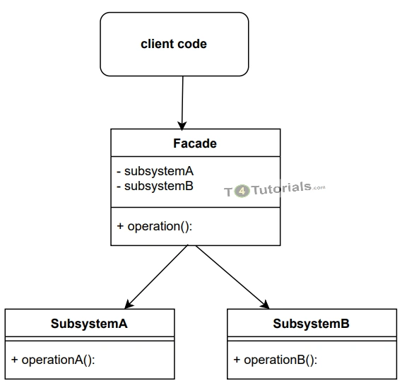
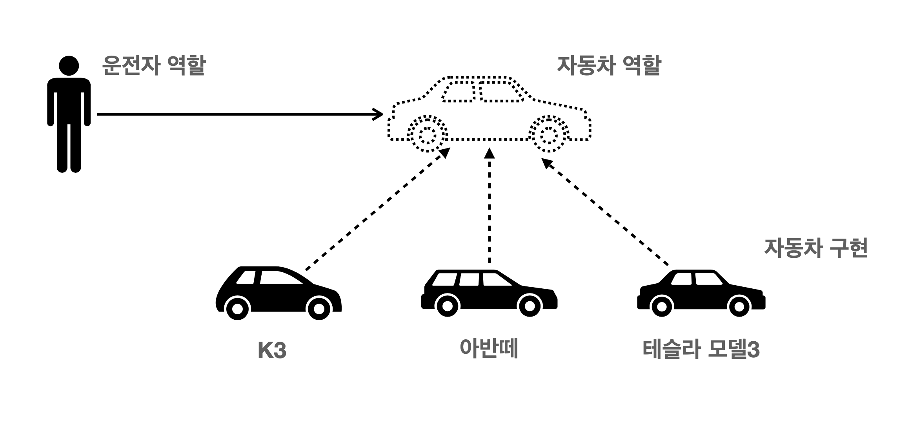
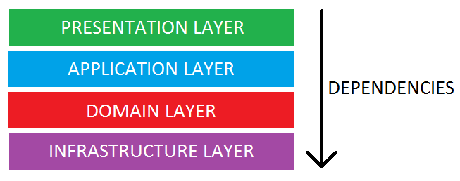
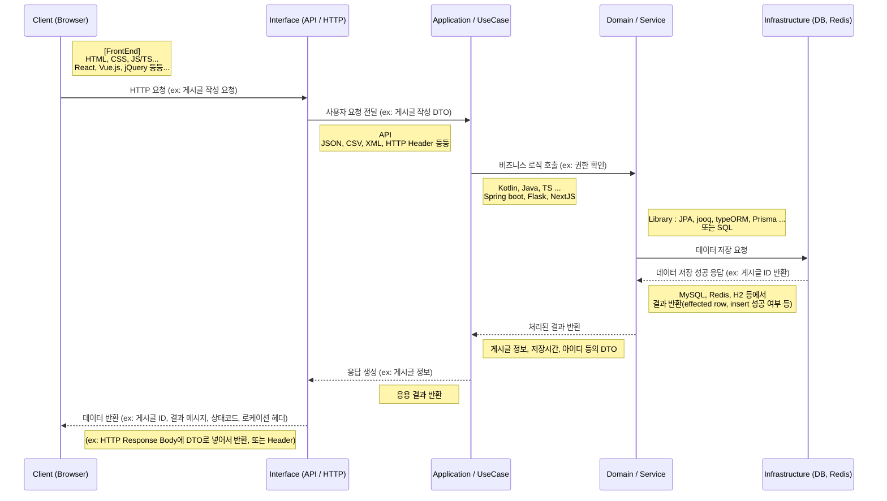

# 프레임워크/라이브러리 적용 샘플 (Kotlin + SpringBoot3)

## 이유

### Productivity

- 중복코드 없앨 수 있음
- 왠만한 기본적인 기능 다 이미 있음, 없으면 찾아보면 또 왠만하면 있음
  (Gradle, NPM 과 같은 의존성 관리 도구로)

#### 모듈화가 쉽다.

> 스프링 + 코틀린
>
> ```kotlin
> class config {
>     @Bean // IoC 로 신경 안써도됨, 인터페이스로 대충 써도 구현체 있는거 갖다줌
>     fun 알아서가져와1(): 초식동물 = 다람쥐()
>
>     @Bean
>     fun 알아서가져와2(): PasswordEncoder = BCryptPasswordEncoder()
> }
> ```
>
> ```kotlin
> // 1. 생성자 주입 (권장, @Autowired 도 생략 가능)
> @Service
> class UserService(private val encoder1: PasswordEncoder) {
>     fun savePassword(password: String) {
>         val encryptedPassword = encoder1.encode(password) // BCryptPasswordEncoder 로 암호화됨
>     }
> 
>     @Autowired // 2. 필드 주입 (비추, 버그 가능성과 테스트 어려움, 느림)
>     private lateinit var encoder2: PasswordEncoder
> 
>     private lateinit var encoder3: PasswordEncoder
> 
>     @Autowired // 3. setter 주입 (어떤 순간에 바꿔낄 때)
>     fun setEncoder(encoder: PasswordEncoder) {
>         this.encoder3 = encoder
>     }
> 
>     @Autowired
>     fun encrypt(password: String, encoder3: PasswordEncoder) { // 4. 메서드 주입
>         val encryptedPassword = encoder3.encode(password) // BCryptPasswordEncoder 로 암호화됨
>     }
> }
> ```

> 라라벨 + PHP
> ```php
> <?php
>
> class HashingServiceProvider extends ServiceProvider {
>     public function register() {
>         $this->app->bind(Hasher::class, BcryptHasher::class);
>     }
> }
>
> // ...
>
> // 설정파일 등에서 등록
> 'providers' => [
>       App\Providers\HashingServiceProvider::class,
>       // 기타 등등 ...
> ],
> ```
>
> ```php
> <?php
>
> class UserService {
>
>     private $encoder;
>
>     public function __construct(Hasher $encoder) { // 생성자 주입
>         $this->encoder = $encoder; // BcryptHasher
>     }
>
>     public function savePassword(string $password): void {
>         $encryptedPassword = $this->encoder->make($password); // BcryptHasher로 암호화
>         // ... 
>     }
>
> }
> ```

#### 그래서 나중에 뭔가를 쉽게쉽게 바꿀 수 있음 (개발하기 편함)

```kotlin
// 이 코드를
class config {
    @Bean
    fun passwordEncoder(): PasswordEncoder = BCryptPasswordEncoder()
}

// 이렇게 바꾸면 서버에서 사용하는 모든 비밀번호 암호화는 SCrypt 방식을 사용
class config {
    @Bean
    fun passwordEncoder(): PasswordEncoder = SCryptPasswordEncoder()
}
```

### Generativity (생성력, 재활용이나 응용해서 새로운걸 쉽게 만들 수 있음.)



```kotlin
@Service
class UserFacade(
    private val userService: UserService,
    private val userBoardService: UserBoardService
) {

    @Transactional // 데이터 조작을 하나의 단위로 묶음
    fun register(id: String, password: String) {
        val user = userService.save(id, password)
        userBoardService.post("${user.id}님이 방금 가입했음")
        // ..  기타 등등
    }

}
```

### 코드가독성 (Human Readable Code, Narrative, Convention 등등 ...)

> 관례적인 컨벤션
> - 대문자 + 언더바 (스네이크케이스) : 상수 (e.g. MAXIMUM_SIZE)
> - 카멜케이스 : 변수/함수 (e.g. userId)
> - 대문자 접두사 + 카멜케이스 (파스칼케이스) : 클래스/객체 (e.g. UserService)

#### 클래스명, 함수와 컬럼, 테이블, 변수 등 이름만 봐도 역할을 파악할 수 있게

```kotlin
@Service
class DeliveryFacade( // 배달 UseCase
    private val userService: UserService, // 유저 
    private val restaurantService: restaurantService, // 식당
    private val riderService: RiderService, // 배달 기사
    private val paymentService: PaymentService, // 결제 시스템
    private val notification: NotificationEventPublisher // 알림 이벤트
) {

    fun userOrder(orderInfo: OrderDTO.Command.UserOrder) {
        // early exit, 바로 바로 확인해서 불필요한 DB 조회, 이벤트 안나게
        val user = userService.findById(orderInfo.userId) 
            ?: throw UserNotFoundException() 
        if (!paymentService.hasMoney(user, orderInfo.totalPrice))
            throw NoMoneyException()  

        val restaurant = restaurantService.findById(orderInfo.restaurantId)
            ?: throw RestaurantNotFoundException()
        if (!restaurantService.hasEnoughFood(restaurant, orderInfo.orderFoodList))
            throw NoFoodException()

        notification.publish(restaurant, orderInfo)
    }

    @EventListener
    fun onRestaurantAcceptOrder(info: OrderEvent.Restaurant.Accept) {
        val riders = riderService.findAllCloseRiders(info.restaurantLocation)
        notification.publish(riders, info.userLocation, info.estimatedCookTime)
    }

    @EventListener
    fun onRestaurantDeclineOrder(info: OrderEvent.Restaurant.Decline) {
        notification.publish(info.user, info.message)
        paymentService.cancel(info.user, info.paymentId)
    }

}

```

#### 객체지향 (응집, 분리, 상속 등 코드 짧게, 수정도 쉽게 쓰는 법)



SOLID

- SRP
  - 하나의 클래스는 하나의 책임만
- OCP
  - 확장에는 열려있고, 수정에는 닫혀있음
- LSP
  - 자식객체는 부모타입을 대체할 수 있어야됨
- ISP
  - 인터페이스 작게 분리해서 조합해서 사용할 수 있게 설계
- DIP
  - 의존성 역전, 구현체 말고 추상체에 의존해서 수정할 때 영향 적게

### Architecture

#### 3~4Layered (DDD, Hexagonal 등도 있음)

- presentation(api, HTTP) / interface(레디스-sub, kafka-consumer)
- application / usecase (응용, 흐름제어)
- domain / service (진짜 도메인 로직, 계산법)
- infrastructure (DB, 캐시, 레디스-pub, kafka-producer 등)




